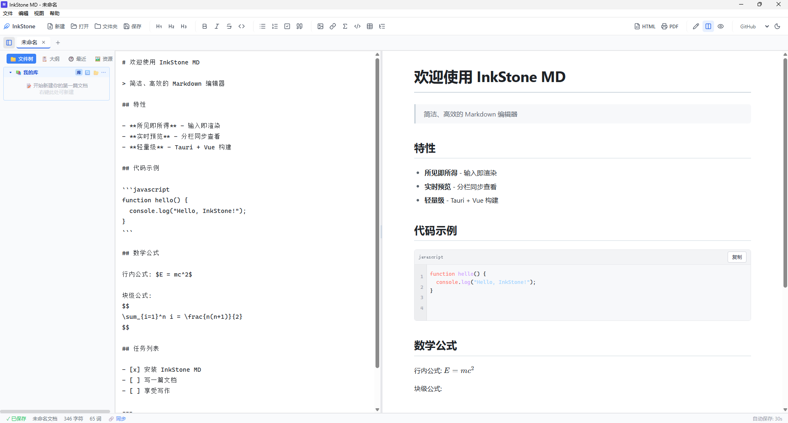

# InkStone MD

[English](./README_EN.md) | 中文

一个轻量、优雅的桌面 Markdown 编辑器，基于 Tauri 2 + Vue 3 构建，支持实时预览、所见即所得、代码高亮、数学公式、Mermaid 图表、多套主题、文件关联等开箱即用的能力。



## 特性

### 内容创作

- **多模式实时预览**:分栏 / 纯编辑 / 纯预览
- **代码块**:highlight.js 100+ 语言高亮 + 行号显示 + 一键复制到剪贴板
- **数学公式**:KaTeX 渲染(行内 `$...$` 与块级 `$$...$$`)
- **Mermaid 图表**:流程图、时序图、甘特图、类图、状态图等
- **任务列表、脚注**:`- [x] 任务` 与 `[^1]` 标准语法
- **搜索替换**:`Ctrl+F`,支持正则转义、上一条/下一条、替换/全部替换
- **自动配对**:输入 `(`/`[`/`{`/`"` 等自动补全另一半
- **粘贴图片**:剪贴板截图自动落盘到 `<file>/assets/`,以相对引用插入
- **图片交互**:预览区 hover 浮出工具栏,支持 25% / 50% / 75% / 100% 缩放 + 左/中/右对齐
- **表格可视化编辑**:点击 `✏️ 编辑` 切换可编辑模式,± 行 / ± 列,`💾 保存到源` 一键写回原 markdown
- **目录插入**:在任意位置写 `[[toc]]` 自动展开为基于标题的多级目录,点击跳转

### 视图与导航

- **大纲 / TOC 侧边栏**:一键跳到对应 heading
- **文件树侧边栏**:打开文件夹,右键新建 / 重命名 / 删除
- **资源管理面板**:自动扫描当前文档引用的所有图片,支持
  - 📂 在文件夹中显示(explorer / Finder / xdg-open)
  - ✏️ 重命名 / 📁 移动 / 🗜️ 一键压缩(jpeg / png)
  - 📋 复制绝对路径 / 🔗 复制 Markdown 引用
  - ✕ 移除文档中的引用
- **专注模式** `F8`:隐藏工具栏与侧边栏,只留正文
- **打字机模式** `F9`:光标始终在屏幕中央
- **最近文件**:自动记录最近打开的 10 个文件

### 文件与协作

- **Windows 文件关联**:双击 `.md` / `.markdown` / `.txt` 直接在 InkStone MD 中打开
- **单实例**:已在运行时再次双击文件,不会拉新进程,直接在前台窗口加载
- **命令行打开**:`inkstone-md xxx.md`
- **拖拽打开**:把文件拖到窗口即可打开
- **30 秒自动保存**:避免误关丢失
- **导出 HTML / PDF**:PDF 走 html2canvas + jsPDF,支持标题保护、表格分页、字体回退

### 主题与个性化

- **4 套内置主题**:`InkStone` / `GitHub` / `One Dark` / `Typora`
- **深色 / 浅色双模式**(One Dark 强制深色)
- 主题与模式均持久化到 `localStorage`
- 工具栏下拉切换,即时预览

## 快捷键

| 快捷键 | 功能 |
|--------|------|
| `Ctrl+N` | 新建文件 |
| `Ctrl+O` | 打开文件 |
| `Ctrl+S` | 保存文件 |
| `Ctrl+Shift+S` | 另存为 |
| `Ctrl+B` | 切换侧边栏 |
| `Ctrl+F` | 搜索替换 |
| `Ctrl+滚轮` / 工具栏 | 切换分栏 / 纯编辑 / 纯预览 |
| `F8` | 专注模式 |
| `F9` | 打字机模式 |
| `Esc` | 关闭搜索面板 |

## 安装

### 从源码构建

```bash
# 1. 安装依赖
npm install

# 2. 开发(Vite 热重载,无 Tauri 窗口)
npm run dev

# 3. Tauri 开发模式(前端 + Rust 后端)
npm run tauri dev

# 4. 构建
npm run build              # vue-tsc 类型检查 + Vite 打包
npm run tauri build        # 打包出 NSIS 安装包(.exe)
```

### 安装包

`npm run tauri build` 完成后,安装包位于:

```
src-tauri/target/release/bundle/nsis/InkStone MD_1.0.0_x64-setup.exe
```

双击安装即可,Windows 会自动注册 `.md` / `.markdown` / `.txt` 文件关联。

### 卸载

通过"控制面板 → 添加或删除程序"卸载。卸载脚本会清理文件关联注册表项,不会留下"打开方式"残留。

## 使用

### 打开文件夹

`Ctrl+O` 打开文件,或工具栏 `📁 文件夹` 打开整个工作区,左侧出现文件树;右键可新建 / 重命名 / 删除。

### 切换主题

工具栏中部下拉选择 `InkStone` / `GitHub` / `One Dark` / `Typora`,右侧 `🌙` / `☀️` 切换深浅色(One Dark 强制深色,选择时会自动切换)。

### 资源管理

打开侧边栏第二个标签 `🖼️ 资源`,即可看到当前文档中所有引用的图片。每个条目支持 `在文件夹中显示 / 重命名 / 移动 / 压缩 / 复制路径 / 复制引用 / 移除引用`。

### 表格编辑

在任意 markdown 表格上,顶部出现工具栏:
- `✏️ 编辑`:切换 td/th 为 contenteditable,直接点击修改
- `+ 行 / - 行 / + 列 / - 列`:结构变更
- `💾 保存到源`:把当前 DOM 表格写回原 markdown(精确按原段匹配,光标不丢)
- `复制为 Markdown`:把表格转 markdown 字符串,写入剪贴板

### 代码块

` ```rust ` 等三反引号包起的代码块,预览区会显示:
- 顶部工具栏:语言徽标 + 复制按钮
- 左侧:行号(等宽对齐,折叠/选中不影响)
- 复制拿到的纯文本不含行号前缀

### 目录

在任意位置写:

```markdown
[[toc]]
```

会展开为基于当前文档所有 `# / ## / ###` 标题的多级目录,点击跳转。

## 技术栈

- **前端**:Vue 3 + TypeScript + Vite + TailwindCSS
- **后端**:Tauri 2.x(Rust)
- **Markdown 解析**:markdown-it + markdown-it-task-lists + markdown-it-footnote
- **代码高亮**:highlight.js
- **数学公式**:KaTeX
- **图表**:mermaid
- **PDF 导出**:jspdf + html2canvas
- **图片处理**(压缩):`image` crate(jpeg / png)

## 项目结构

```
inkstone-md/
├── src/                       # Vue 前端源码
│   ├── App.vue                # 主组件(编辑器、文件树、工具栏、状态栏)
│   ├── main.ts                # Vue 入口
│   └── style.css              # 全局样式 + 4 套主题
├── src-tauri/                 # Tauri 后端
│   ├── src/
│   │   ├── lib.rs             # Rust 库入口(命令、单实例、文件打开)
│   │   └── main.rs            # Rust 二进制入口
│   ├── capabilities/
│   │   └── default.json       # Tauri 权限清单
│   ├── icons/                 # 应用图标
│   ├── Cargo.toml             # Rust 依赖
│   └── tauri.conf.json        # Tauri 配置(窗口、bundle、文件关联)
├── ROADMAP_V1.0.0.md          # V1.0.0 发布规划与 P0/P1 验收清单
├── package.json               # Node 依赖与脚本
├── vite.config.ts             # Vite 配置
├── tailwind.config.js         # TailwindCSS 配置
└── tsconfig.json              # TypeScript 配置
```

### Rust 命令(通过 `invoke` 调用)

| 命令 | 用途 |
|------|------|
| `read_file` / `write_file` | 文本文件读写 |
| `read_file_bytes` / `write_file_bytes` | 二进制文件读写(图片复制等) |
| `get_file_info` | 文件元信息(大小等) |
| `read_directory` | 递归读取目录(忽略 `.` 开头) |
| `create_file` / `create_directory` | 创建 |
| `rename_path` / `delete_path` | 重命名 / 删除 |
| `reveal_in_folder` | 在系统文件管理器中显示(explorer / open -R / xdg-open) |
| `compress_image` | 图片重新编码为 jpeg / png,返回压缩后字节数 |
| `frontend_ready` | 前端握手,触发启动挂起文件的派发 |

## 版本记录

### [1.0.0] - 首发正式版

以"可日常使用"为门槛,集中解决两个阻塞性 BUG,并补齐 Typora 同类核心体验。

#### 🐛 修复
- **图片无法显示**:WebView 默认拒绝 `file://` 协议,启用 `assetProtocol` + `convertFileSrc`,本地绝对路径 / 相对路径 / 网络 URL / base64 全覆盖
- **Win 10 双击 .md 文件无法加载**:缺单实例 + 时序竞态,改用 `tauri-plugin-single-instance` + `tauri-plugin-deep-link`,前端 `frontend-ready` 握手,统一 `open-file` 事件;NSIS `installMode: perMachine` 让文件关联全局生效

#### ✨ 新增
- 代码块行号(每行 `<div class="line">`,复制不影响)
- 代码块一键复制
- 表格可视化编辑:✏️ 编辑 / ± 行 / ± 列 / 💾 保存到源 / 复制为 Markdown
- 目录插入:`[[toc]]` 占位符 + 工具栏按钮 + 锚点跳转
- 资源管理面板:在文件夹中显示 / 重命名 / 移动 / 压缩 / 复制路径 / 复制引用 / 移除引用
- 4 套内置主题:`InkStone` / `GitHub` / `One Dark` / `Typora`
- 粘贴图片自动落盘到 `<file>/assets/`
- 图片缩放 4 档(25 / 50 / 75 / 100%)与对齐 3 档(左 / 中 / 右)
- 单实例:已在运行时双击文件聚焦现有窗口

#### 🔧 改进
- `fileAssociations` 扩展为 `.md` / `.markdown` / `.txt`
- Tauri 启用 `protocol-asset` feature;`Cargo.lock` 同步更新
- `Cargo.toml` 新增依赖:`tauri-plugin-single-instance` / `tauri-plugin-deep-link` / `image`
- 启动参数解析:健壮处理路径含空格 / 引号 / 中文

#### ⚠️ 已知边界
- 资源压缩走 Rust `image` 0.25(纯 Rust,无需外部工具);不支持 webp / avif(后续可加)
- 资源重命名 / 移动 / 压缩弹窗用浏览器原生 `prompt` / `confirm`,后续可替换为自定义 modal
- 主题字体用系统字体,未打包自定义字体文件

### [0.1.2] - 早期开发版

历史版本。实现了多标签页、文件树、搜索替换、KaTeX、Mermaid、自动保存、最近文件、专注 / 打字机模式、HTML / PDF 导出等基础能力,但图片显示与 Win 10 文件关联存在已知 BUG。

## 路线图

V1.0 之后的候选特性见 [ROADMAP_V1.0.0.md](./ROADMAP_V1.0.0.md),包括 DOCX 导出、拼写检查、字体偏好、自定义深色等。

## 贡献

欢迎提交 Issue 与 Pull Request。开发前请先 `npm install` 并确保 `npm run build` 与 `cargo check` 均无错误。

## 许可证

GPL-3.0 License
